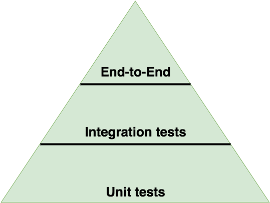

# Testing Project

This project utilizes Jest and @testing-library/react for robust testing.

## Jest

[Jest](https://jestjs.io/) is a popular testing library for JavaScript applications. It provides a simple and efficient way to write tests for your code.

## @testing-library/react

[@testing-library/react](https://testing-library.com/docs/react-testing-library/intro) is a testing library for React components. It focuses on how your components interact with the DOM, making tests closer to how your users interact with your application.

## Testing Pyramid

The Testing Pyramid is a concept that suggests a strategy for distributing tests based on their type. In this project, we adhere to this strategy:

- **Unit Tests (70%)**: These tests cover individual components or modules, providing quick and precise feedback.

- **Integration Tests (20%)**: Tests that check the interaction between components, ensuring they work well together.

- **End-to-End (E2E) Tests (10%)**: These tests simulate real user interaction with the application, providing end-to-end verification.

## Running Tests

1. Install dependencies: `npm install`
2. Run tests: `npm test`

## Acknowledgments

Thanks to Jest and @testing-library/react for providing powerful tools to ensure quality testing of our application.
______

____

# Проект Тестирования

Этот проект использует Jest и @testing-library/react для обеспечения качественного тестирования.

## Jest

[Jest](https://jestjs.io/) - это популярная библиотека тестирования для JavaScript-приложений. Она обеспечивает простой и эффективный способ написания тестов для вашего кода.

## @testing-library/react

[@testing-library/react](https://testing-library.com/docs/react-testing-library/intro) - это библиотека для тестирования React-компонентов. Она фокусируется на том, как ваши компоненты взаимодействуют с DOM, делая тесты ближе к тому, как ваши пользователи взаимодействуют с вашим приложением.

## Пирамида Тестирования

Пирамида тестирования - это концепция, которая предлагает стратегию распределения тестов в зависимости от их типа. В данном проекте мы следуем этой стратегии:

- **Unit Тесты (70%)**: Эти тесты покрывают отдельные компоненты или модули, обеспечивая быструю и точную обратную связь.

- **Интеграционные Тесты (20%)**: Тесты, проверяющие взаимодействие между компонентами, обеспечивая корректную работу вместе.

- **End-to-End (E2E) Тесты (10%)**: Эти тесты моделируют реальное взаимодействие пользователя с приложением, обеспечивая проверку от начала до конца.

## Запуск Тестов

1. Установите зависимости: `npm install`
2. Запустите тесты: `npm test`

## Благодарности

Благодарим Jest и @testing-library/react за предоставление мощных инструментов для обеспечения качественного тестирования нашего приложения.

